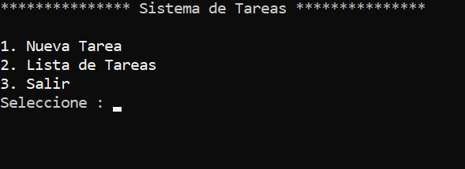
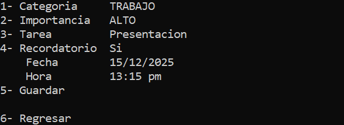
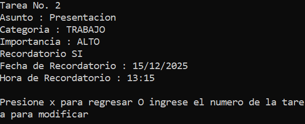
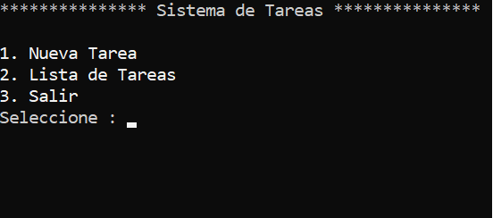
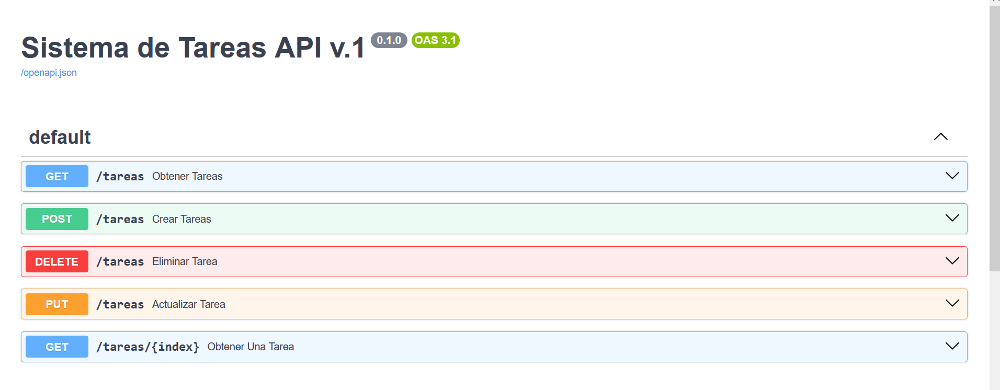
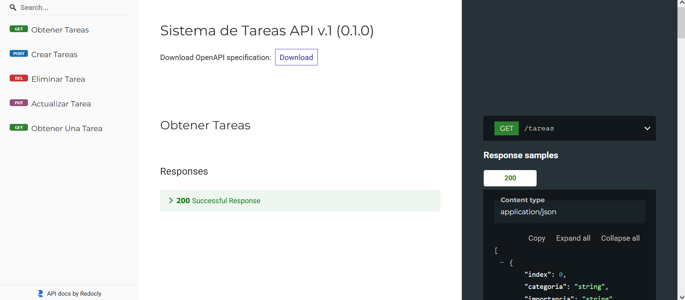
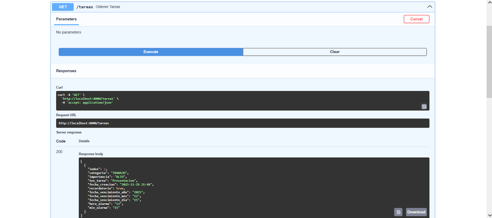

# ✅ Sistema de Gestión de Tareas + API REST

Un sistema completo de gestión de tareas con interfaz de consola **Y** API REST construida con FastAPI, incluyendo persistencia de datos en JSON.

## 🚀 Características Principales

### 🖥️ Interfaz de Consola
- **📝 Creación y edición de tareas** con categorías personalizadas
- **🎯 Sistema de importancia** (Bajo, Medio, Alto)
- **⏰ Recordatorios con fechas y horas** específicas
- **💾 Persistencia de datos** en archivo JSON
- **🎨 Interfaz colorida** con Colorama

### 🌐 API REST (FastAPI)
- **RESTful endpoints** para todas las operaciones CRUD
- **Documentación automática** con Swagger UI y ReDoc
- **Validación de datos** con Pydantic
- **Modelos de respuesta** tipados
- **Manejo de errores** HTTP estándar

## 📸   Screenshots





### Interfaz de Consola



### API REST Documentation






## 🏗️ Arquitectura del Proyecto

sistema_tareas/
├── 📁 Interfaz Consola
│ ├── sistema_tareas.py # Lógica principal y menús
│ ├── tareas.py # Clase Tarea con propiedades
│ ├── historial_tareas.py # Manejo de persistencia JSON
│ └── enumeraciones.py # Enums para categorías
│
├── 🌐 API REST
│ ├── api.py # Endpoints FastAPI
│ ├── tareas.py # Modelos Pydantic
│ └── historial_tareas.py # Capa de datos
│
└── 💾 Datos
└── tareas.json # Base de datos JSON

## 🛠️ Tecnologías Utilizadas
- **Python 3.x** con POO
- **FastAPI** para API REST
- **Pydantic** para validación de datos
- **JSON** para persistencia
- **Colorama** para interfaz colorida
- **Enum** para categorías predefinidas
- **Datetime** para manejo de fechas

## 🏃‍♂️ Instalación y Ejecución

### Interfaz de Consola
```bash
# Instalar dependencias
pip install colorama

# Ejecutar el sistema
python sistema_tareas.py

# Instalar FastAPI y Uvicorn
pip install fastapi uvicorn

# Ejecutar la API
uvicorn api:app --reload

# Acceder a la documentación
# http://localhost:8000/docs
# http://localhost:8000/redoc

🔌 Endpoints de la API
Método	Endpoint	Descripción
GET	/tareas	Obtener todas las tareas
GET	/tareas/{id}	Obtener tarea específica
POST	/tareas	Crear nueva tarea
PUT	/tareas/{id}	Actualizar tarea existente
DELETE	/tareas/{id}	Eliminar tarea

🎯 Lo que Aprendí
Conceptos Avanzados

Arquitectura de APIs REST con FastAPI

Modelos de datos con Pydantic

Documentación automática con OpenAPI

Separación de concerns entre consola y API

Tipado estático y validación de datos

Patrones de Diseño

Data Transfer Objects (DTOs)

CRUD operations estandarizadas

Manejo de errores HTTP

Serialización/Deserialización JSON